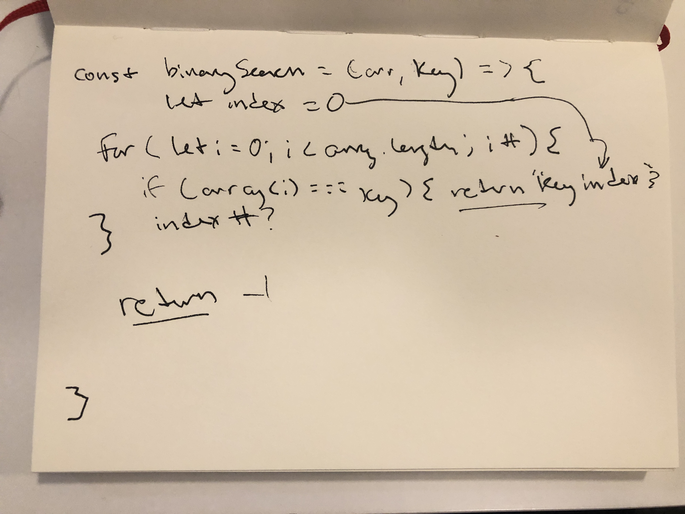

# Binary Search
A function that finds the index of number of a match pair of numbers

## Challenge
Create a function that does a binary search using no methods.

## Approach & Efficiency
I loop through the array and if I find a match i return a variable called index that is a number. That number is being increased by one each loop so that it keeps track of the index number. If no match is found, I return -1

## Solution
