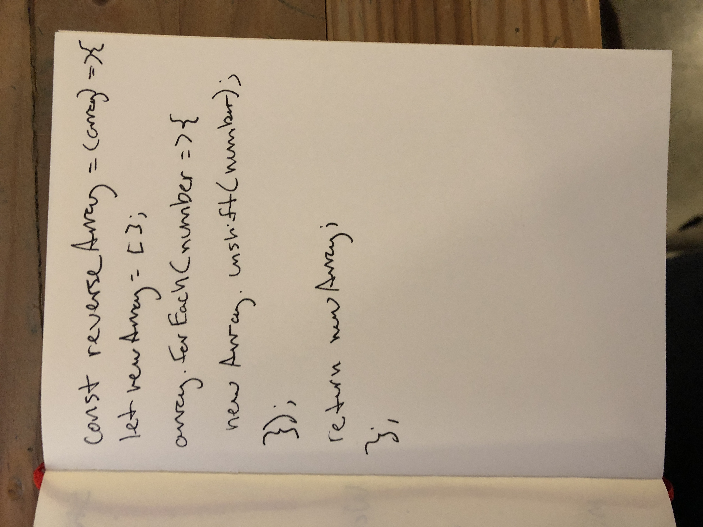

# Reverse an Array
A function that reverse the order of the items in an array

## Challenge
Create a function that reverses an array without using .reverse()

## Approach & Efficiency
This function establishes an empty array then uses unshift() to add the items in the passed in array to the new array in reverse order.

## Solution
